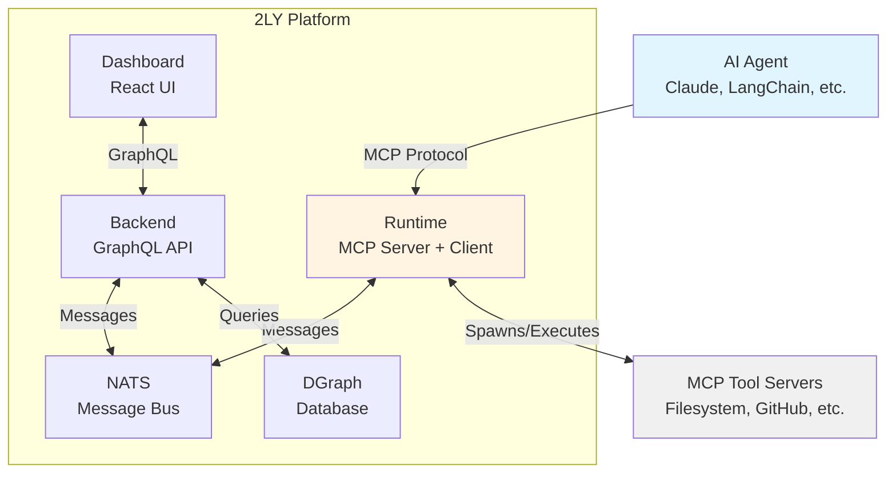

2LY connects AI agents to tools via MCP using NATS messaging, DGraph storage, and distributed runtimes.

## Quick Architecture



## Core Components

### Agents

AI systems that connect via MCP protocol:

- Claude Desktop
- LangChain/LangGraph applications
- Custom Python/TypeScript agents
- n8n workflows

**Role:** Request and invoke tools for task execution

### Runtime

Distributed execution environment (`@2ly/runtime`):

- **Agent Mode**: Acts as MCP server for agents
- **Tool Mode**: Spawns and manages MCP tool servers
- **Deployment**: Local, cloud, or edge

**Role:** Bridge between agents and tools via NATS

### Backend

Central orchestration service:

- **GraphQL API**: Manage workspaces, runtimes, tools
- **Runtime Coordination**: Track runtime health and route messages
- **Tool Discovery**: Aggregate tool capabilities

**Role:** Coordinate distributed components and persist configuration

### NATS

Message bus for all communication:

- **Pub/Sub**: Real-time updates
- **Request/Reply**: Tool execution
- **KV Store**: Heartbeat and config

**Role:** Enable decoupled, scalable communication

### DGraph

Graph database for platform data:

- Workspaces and users
- Runtimes and their configurations
- MCP servers and discovered tools
- Tool capabilities and assignments

**Role:** Persist and query platform state

### Dashboard

React-based management interface:

- Monitor runtime health
- Configure MCP servers
- Assign tool capabilities
- View tool execution

**Role:** User interface for platform management

## How It Works

1. **Agent connects** to runtime via MCP
2. **Runtime registers** with backend via NATS
3. **Tools are discovered** and sent to agent
4. **Agent calls tool** → NATS routes to tool runtime → executes → returns result

## Why This Architecture?

### Flexible Deployment

**Run anywhere.** Runtimes connect outbound to NATS, so they work:

- Behind corporate firewalls (no inbound ports needed)
- On edge devices with intermittent connectivity
- In multiple cloud regions simultaneously
- On developer laptops for testing

**Geographic distribution** becomes trivial—just deploy runtimes closer to your data or users.

### High Availability

**Message persistence** means no lost requests during deployments or failures. JetStream stores messages until they're processed.

**Automatic failover:** If a runtime goes down, NATS routes to healthy instances automatically. No manual intervention, no downtime.

**Zero-downtime deployments:** Update services without interrupting active tool calls. The message bus handles routing during transitions.

### Observability Built-In

**See everything.** Track every tool call, monitor runtime health, debug failures—all from the dashboard.

**Enterprise-ready:** Audit trails, usage analytics, and debugging tools included. No need for third-party monitoring services for basic observability.

For more details, see the [Why 2LY section in Installation](/getting-started/installation#why-2ly).

## Deployment

### Run locally

Start all 2LY services on localhost via Docker Compose:

```bash
docker compose up -d
```

Access at http://localhost:8888. See [Installation](/getting-started/installation) for details.

### Production

You can deploy 2LY using official container images:

- **Backend**: [`ghcr.io/alpinai/backend:latest`](https://github.com/orgs/AlpinAI/packages/container/package/backend)
- **Main Runtime**: [`ghcr.io/alpinai/runtime:latest`](https://github.com/orgs/AlpinAI/packages/container/package/runtime)
- **Frontend**: [`ghcr.io/alpinai/frontend:latest`](https://github.com/orgs/AlpinAI/packages/container/package/frontend)
- **Documentation**: [`ghcr.io/alpinai/doc:latest`](https://github.com/orgs/AlpinAI/packages/container/package/doc)
- **Dgraph Database**: [`dgraph/dgraph:latest`](https://hub.docker.com/r/dgraph/dgraph)
- **NATS**: [`nats:2.10-alpine`](https://hub.docker.com/_/nats)

See [`docker-compose.yml`](/docker-compose.yml) for an example.

## Next Steps

- [Installation](/getting-started/installation) - Set up 2LY in 2 minutes
- [Quick Start](/getting-started/quick-start) - Your first tool workflow
- [The Stack](/deep-dive/stack) - Deep dive into architecture components
- [NATS Messaging](/deep-dive/nats-messaging) - Message broker details
- [Detailed Architecture](/deep-dive/architecture-detailed) - Full technical deep-dive
